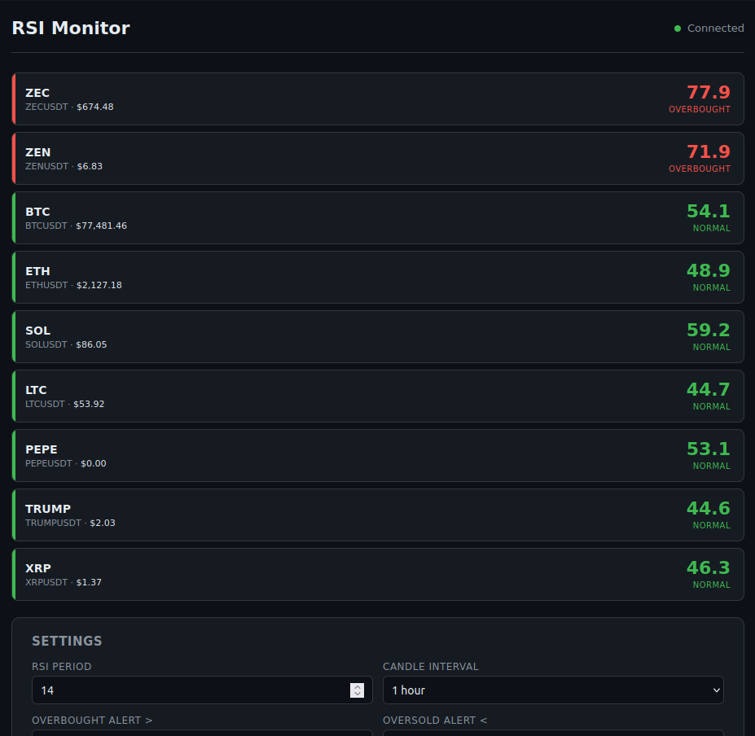

# RSI Alert System — Real-Time Crypto RSI Monitor

<p align="center">
  
  <br>
  <a href="rsi-alert-system-rust-trimmed.webm">&#9654; Watch demo video</a>
  &nbsp;·&nbsp;
  <a href="rsi-alert-system-rust-trimmed.mp4">&#9654; Watch demo (MP4)</a>
</p>

Track the **Relative Strength Index (RSI)** of your favorite cryptocurrencies in real time. Get **browser notifications** and **sound alerts** when a coin enters overbought or oversold territory. Built as a single lightweight Rust binary — no database, no cloud dependency, just one command and your browser.

---

## Features

- **Real-time RSI tracking** — Fetches live OHLCV data from the Binance free API
- **Browser notifications** — Desktop push alerts when RSI crosses your thresholds
- **Sound alerts** — Two-tone audio cue so you never miss a signal
- **Multi-coin support** — Track BTC, ETH, SOL, ADA, DOGE, LINK and more
- **Persistent settings** — Your coins, thresholds, and preferences survive app restarts
- **Auto port fallback** — If port 3000 is taken, the app finds the next free port
- **Dark theme dashboard** — Clean, readable UI with color-coded RSI status

### RSI Thresholds (default)

| Zone | RSI Range | Color | Action |
|------|-----------|-------|--------|
| Overbought | > 70 | Red | Alert triggered |
| Normal | 30 – 70 | Green | No alert |
| Oversold | < 30 | Blue | Alert triggered |

All thresholds are fully configurable from the dashboard.

---

## Quick Start

### Prerequisites

- **Rust toolchain** (1.80+). Install via [rustup](https://rustup.rs/):
  ```bash
  curl --proto '=https' --tlsv1.2 -sSf https://sh.rustup.rs | sh
  ```

### Run

```bash
git clone <repo-url>
cd rsi-alert-system-rust
./run.sh
```

Open **http://127.0.0.1:3000** in your browser.

If port 3000 is in use, the app automatically tries 3001, 3002, etc. and prints the correct URL.

### Dev mode

```bash
./run.sh --dev
```

This uses `cargo run` directly for faster iteration.

---

## Usage

### Track a coin

1. Type a coin name in the input field (e.g. `ETH`, `SOL`, `ADA`, `DOGE`)
2. Click **Track Coin**
3. The card appears immediately with a loading indicator, then shows live RSI once data arrives

### Remove a coin

Click the **×** button next to any coin tag.

### Adjust thresholds

Change the overbought/oversold values in the Settings panel and click **Save Settings**. Changes take effect immediately.

### Enable notifications

Toggle **Desktop Notifications** on — your browser will ask for permission. Grant it to receive push alerts when RSI enters a danger zone.

### Change data frequency

Select a different candle interval (1m, 5m, 15m, 1h, 4h, 1d) and adjust the check interval in seconds.

---

## How RSI Is Calculated

This app uses **Wilder's Smoothing Method** (standard 14-period RSI):

```
RSI = 100 - (100 / (1 + RS))
RS = Average Gain / Average Loss
```

- **Average Gain/Loss** uses Wilder's smoothing: `new_avg = (prev_avg × (period-1) + current) / period`
- Requires at least 15 candles of historical data before producing a value
- Verified with unit tests for constant-up (RSI=100), constant-down (RSI=0), and alternating (RSI≈50) scenarios

---

## API Endpoints

| Method | Path | Description |
|--------|------|-------------|
| `GET` | `/` | Dashboard HTML |
| `GET` | `/api/rsi` | Current RSI for all tracked coins |
| `GET` | `/api/config` | Current configuration |
| `POST` | `/api/config` | Update configuration |
| `GET` | `/events` | Server-Sent Events (real-time push) |

Example response from `/api/rsi`:

```json
[
  {
    "symbol": "BTCUSDT",
    "display_name": "BTC",
    "rsi": 53.34,
    "price": 77447.80,
    "alert": null
  }
]
```

---

## Project Structure

```
rsi-alert-system-rust/
├── Cargo.toml              # Rust dependencies
├── run.sh                  # One-command launcher
├── rsi-alert-system-rust.png  # Dashboard screenshot
├── static/
│   └── index.html          # Embedded web dashboard (served by Rust)
└── src/
    ├── main.rs             # HTTP server, SSE streaming, background monitor
    ├── binance.rs          # Binance free API client (OHLCV klines)
    ├── rsi.rs              # RSI calculation engine (4 unit tests)
    └── config.rs           # Settings persistence (JSON file on disk)
```

### Tech Stack

- **Backend:** Rust, Axum (web server), Tokio (async runtime)
- **Data source:** Binance public API (no API key required)
- **Frontend:** Vanilla JS, Server-Sent Events, Web Audio API, Notification API
- **Storage:** JSON file on disk (`rsi_settings.json` next to the binary)

---

## Adding a New Coin (under the hood)

The coin list is stored in `rsi_settings.json`. You can edit it directly:

```json
{
  "coins": ["BTCUSDT", "ETHUSDT", "SOLUSDT"],
  "interval": "1h",
  "rsi_period": 14,
  "overbought_threshold": 70.0,
  "oversold_threshold": 30.0
}
```

To add a coin programmatically:

```bash
curl -X POST http://127.0.0.1:3000/api/config \
  -H "Content-Type: application/json" \
  -d '{"coins": ["BTCUSDT", "ETHUSDT", "SOLUSDT"]}'
```

The system is modular — adding a new pair requires zero code changes.

---

## Troubleshooting

| Problem | Solution |
|---------|----------|
| `Address already in use` | The app auto-falls back to the next port. Check logs for the actual URL. |
| No RSI data showing | The app needs 15+ candles before calculating. Wait one check interval. |
| Notifications not working | Click the Desktop Notifications toggle to trigger the browser permission prompt. |
| Coin not found | Make sure the symbol exists on Binance. Add `USDT` suffix if needed (e.g. `BTCUSDT`). |

---

## License

MIT
